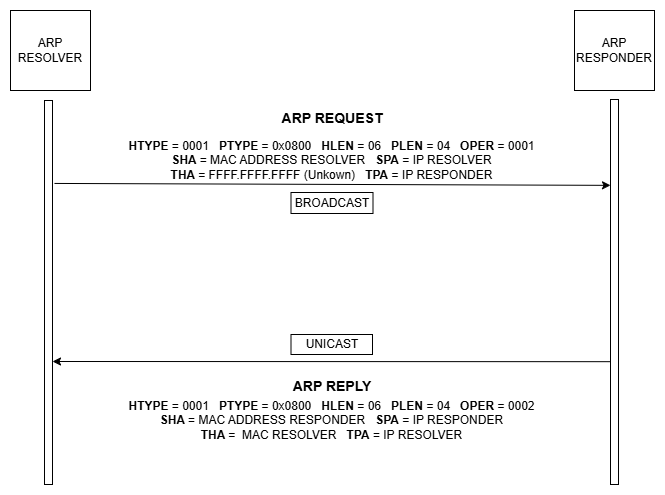
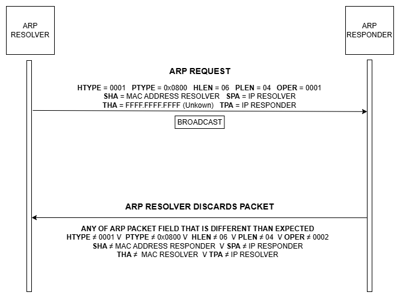

# ARP Resolver

## Uvod
U savremenim mrežama, komunikacija između uređaja zasniva se na složenom skupu protokola koji omogućavaju pouzdanu razmjenu podataka. Jedan od osnovnih protokola u okviru mrežnog sloja je ARP (*engl. Address Resolution Protocol*), čija je osnovna funkcija povezivanje logičkih IP (*engl. Internet Protocol*) adresa sa fizičkim MAC (*engl. Media Access Control*) adresama. Bez ovog protokola, uređaji unutar lokalne mreže ne bi mogli efikasno komunicirati, jer bi nedostajala veza između apstraktnog adresiranja i stvarne hardverske identifikacije. ARP se koristi u gotovo svim Ethernet okruženjima i predstavlja temeljnu komponentu mrežne infrastrukture [1].

## ARP protokol i scenariji razmjene poruka
U Ethernet mrežama svaki put kada host ili ruter treba enkapsulirati IP paket u okvir, poznata je IP adresa sljedećeg uređaja, ali ne i njegova MAC adresa. Da bi se uspostavila komunikacija, koristi se ARP, koji omogućava dinamičko povezivanje IP adrese sa odgovarajućom MAC adresom [1].

Prema Odomu [2], ARP protokol se temelji na razmjeni dvije osnovne poruke:
  - **ARP Request** – poruka kojom jedan uređaj na istoj podatkovnoj vezi traži informaciju o hardverskoj adresi drugog hosta. U poruci se obično navodi poznata ciljna IP adresa, dok je polje za ciljnu hardversku adresu postavljeno na nule. Time se od uređaja s navedenom IP adresom traži da u svom ARP Reply odgovoru otkrije vlastitu hardversku (Ethernet) adresu.  
  - **ARP Reply** – poruka kojom uređaj odgovara na prethodno primljeni ARP zahtjev. U njoj se nalaze podaci o hardverskoj (Ethernet) adresi i IP adresi samog pošiljatelja, zapisani u poljima za izvorni hardver i izvornu IP adresu.   

ARP koristi vrlo jednostavnu strukturu poruke koja može da sadrži zahtjev ili odgovor za rezoluciju adrese. Ove poruke se prenose na sloju podatkovne veze (*engl. Data Link Layer*) kao sirovi sadržaj paketa. Kada se koristi Ethernet, vrijednost 0x0806 u polju EtherType označava da je riječ o ARP okviru. Dužina ARP poruke zavisi od formata adresa koje se koriste na mrežnom i link sloju. U nastavku prikazana je slika 1 na kojoj je predstavljen jedan ARP paket, te su navedene funkcionalnosti svih polja koja sačinjavaju taj paket. Vrijednosti ARP parametara su standardizovane i održava ih IANA (*engl. Internet Assigned Numbers Authority*) [3].

  
  
<b>Slika 1:</b> Struktura ARP poruke [3]

- **Hardware Type (HTYPE)**: Polje određuje tip protokola mrežne veze. U ovom primjeru, vrijednost 1 označava Ethernet. Dužina polja je 16 bita.
- **Protocol Type (PTYPE)**: Ovo polje određuje internetwork protokol za koji je ARP zahtjev namijenjen. Za IPv4, vrijednost je 0x0800. Dozvoljene vrijednosti PTYPE dijele isti prostor numerisanja kao i EtherType. Dužina polja je 16 bita.
- **Hardware Length (HLEN)**: Polje predstavlja dužinu (u oktetima) hardverske adrese. Za Ethernet, dužina adrese je 6. Dužina polja je 8 bita. 
- **Protocol Length (PLEN)**: Dužina (u oktetima) internetwork adrese. Internetwork protokol je određen u PTYPE. U ovom primjeru: IPv4 adresa ima dužinu 4. Dužina polja je 8 bita. 
- **Operation (OPER)**: Određuje operaciju koju pošiljalac izvodi: 1 za zahtjev, 2 za odgovor.  Dužina polja je 16 bita.
- **Sender Hardware Address (SHA)**: MAC adresa pošiljaoca. U ARP zahtjevu ovo polje označava adresu hosta koji šalje zahtjev. U ARP odgovoru ovo polje označava adresu uređaja koji je tražen. Dužina polja je 48 bita. 
- **Sender Protocol Address (SPA)**: IP adresa pošiljaoca. Dužina polja je 32 bita.
- **Target Hardware Address (THA)**: MAC adresa namijenjenog primaoca. U ARP zahtjevu ovo polje se zanemaruje. U ARP odgovoru ovo polje označava adresu uređaja koji je inicirao ARP zahtjev. Dužina polja je 48 bita. 
- **Target Protocol Address (TPA)**: IP adresa namijenjenog primaoca. Dužina polja je 32 bita [3].

Prilikom razmjene ARP Request i ARP Reply poruka, polja poput HTYPE, PTYPE, HLEN i PLEN ostaju nepromijenjena, jer uvijek opisuju tip mreže i veličinu adresa.

U ARP Requestu popunjena su polja sa hardverskom i protokolskom adresom pošiljaoca (SHA i SPA), dok je polje ciljne hardverske adrese (THA) prazno ili ignorisano (najčesće se pišu nule u to polje), a ciljana protokolska adresa (TPA) sadrži IP adresu uređaja čija se MAC adresa traži. Također, OPER polje ima vrijednost 1.

U ARP Replyu, uređaj koji odgovara prvo upoređuje vrijednost SPA iz zahtjeva sa vlastitom IP adresom. Ako se podudara, generiše odgovor. U tom odgovoru, SHA i SPA polja se popunjavaju njegovom vlastitom MAC i IP adresom, dok se vrijednosti koje su došle od Resolvera (inicijatora zahtjeva) smještaju u THA i TPA. Polje OPER tada dobije vrijednost 2. Na taj način se originalnom pošiljaocu vraća tražena veza između ciljne IP adrese i odgovarajuće MAC adrese (slika 2). 

  
  
<b>Slika 2:</b> Grafički prikaz uspješne rezolucije

Drugi scenario predstavlja obacivanje ARP Reply-a zbog nočekivanog sadržaja. Bilo koje od prethodno definisanih polja u ARP paketu može biti različito od očekivanog, zvog čega će Resolver odbaciti taj isti paket. Na slici 3 prikazan je opisani scenarij. 

  
  
<b>Slika 3:</b> Grafički prikaz odbacivanja paketa

## Opis ulaznih i izlaznih signala modula

Signali koji se koriste tokom izrade zadanog modula, predstavljeni su u nastavku: 

| IN/OUT | Tip                | Signal       | Opis                                                                |
|-----------|---------------------|--------------|-----------------------------------------------------------------------------|
| IN        | STD_LOGIC           | clock        | Clock signal koji pokreće sekvencijalnu logiku.                              |
| IN        | STD_LOGIC           | reset        | Asinhroni reset, vraća modul u početno stanje.                              |
| IN        | STD_LOGIC           | resolve      | Impuls kojim se inicira ARP rezolucija za zadati `ip_address`.              |
| IN        | STD_LOGIC_VECTOR(31 downto 0) | ip_address   | IP adresa za koju se traži MAC adresa.                                      |
| OUT       | STD_LOGIC           | done         | Impuls (1 takt) označava da je rezolucija završena i da je `mac_address` validan. |
| OUT       | STD_LOGIC_VECTOR(47 downto 0) | mac_address  | Rezultat rezolucije – MAC adresa dobijena iz ARP reply paketa.              |
| OUT       | STD_LOGIC           | busy         | Pokazuje da je rezolucija u toku; ide na 1 nakon `resolve`, vraća se na 0 nakon odgovora ili timeout-a. |
| IN        | STD_LOGIC_VECTOR(7 downto 0)  | in_data      | Bajt‑stream ARP reply paketa (Ethernet + ARP polja).                        |
| IN        | STD_LOGIC           | in_valid     | Označava da je bajt na `in_data` važeći.                                    |
| IN        | STD_LOGIC           | in_sop       | Start of packet – aktivan na prvom bajtu ARP reply paketa.                  |
| IN        | STD_LOGIC           | in_eop       | End of packet – aktivan na zadnjem bajtu ARP reply paketa.                  |
| OUT       | STD_LOGIC           | in_ready     | Izlaz iz modula koji pokazuje da li je modul spreman da primi sljedeći bajt.     |
| OUT       | STD_LOGIC_VECTOR(7 downto 0)  | out_data     | Bajt‑stream ARP request paketa (sva polja).                      |
| OUT       | STD_LOGIC           | out_valid    | Označava da je bajt na `out_data` važeći.                                   |
| OUT       | STD_LOGIC           | out_sop      | Start of packet – aktivan na prvom bajtu ARP request paketa.                |
| OUT       | STD_LOGIC           | out_eop      | End of packet – aktivan na zadnjem bajtu ARP request paketa.                |
| IN        | STD_LOGIC           | out_ready    | Dolazi od prijemnika; pokazuje da li može da primi sljedeći bajt.            |

### Scenarij 1: Uspješna ARP rezolucija

U ovom scenariju prikazano je ponašanje modula kada se tražena IP adresa uspješno razriješi u odgovarajuću MAC adresu. Nakon inicijalnog resetovanja sistema, svi izlazni signali se postavljaju u početno stanje: `done = 0`, `busy = 0`, a `mac_address` je nevažeći. Modul miruje i čeka naredbu za pokretanje rezolucije.

Proces započinje impulsom na signalu `resolve`. Time se inicira rezolucija za IP adresu koja se nalazi na ulazu `ip_address`. Odmah nakon toga, signal `busy` prelazi u stanje 1, što označava da je sistem zauzet i da je rezolucija u toku. Modul zatim generiše ARP request paket, koji se bajt po bajt šalje preko izlaznog interfejsa `out_data`. Tok podataka je praćen kontrolnim signalima: `out_valid` označava da je bajt važeći, `out_sop` se aktivira na početku paketa, a `out_eop` na njegovom kraju. Na ovaj način se prema mreži šalje broadcast poruka kojom se traži MAC adresa za zadati IP.

Nakon određenog vremena, od Respondera stiže ARP reply paket. Podaci dolaze kroz ulazni interface `in_data`, uz prateće signale `in_valid`, `in_sop` i `in_eop`, dok `in_ready` pokazuje da je modul spreman da primi podatke. U polju *SHA* ovog paketa nalazi se tražena MAC adresa. Modul je izdvoji i postavi na izlaz `mac_address`.

Kada je MAC adresa uspješno pročitana, signal `done` se aktivira na jedan takt, čime se označava da je rezolucija završena i da je rezultat validan. Nakon toga, `busy` se vraća u stanje 0, što znači da je sistem slobodan i spreman za novu rezoluciju.

  
  
<b>Slika 4:</b> Wavedrom - uspješna rezolucija

## Dizajn konačnog automata - FSM dijagram

## Modeliranje sklopa u VHDL-u i sinteza u Intel Quartus Prime

## Testno okruženje i verifikacija u ModelSim-u

## Zaključak 

### Smjernice za budući rad

## Literatura
[1] W. Odom, CCNA 200-301 Official Cert Guide, Volume 1, Cisco Press, sve. 1, izd. 1, str. 77-78, 2020.

[2] W. Odom, CCNA 200-301 Official Cert Guide, Volume 2, Cisco Press, sve. 2, izd. 1, str. 496, 2020.

[3] "Address Resolution Protocol" (bez dat.). u Wikipedia, the Free Encyclopedia. Dostupno: https://en.wikipedia.org/wiki/Address_Resolution_Protocol [pristupano 09.10.2025.]

[4] Avalon Interface Specification, Intel Quartus Prime Design Suite 20.1, v2022.01.24

