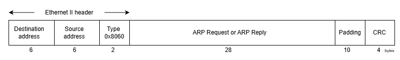

# ARP Resolver

## Uvod
U savremenim mrežama, komunikacija između uređaja zasniva se na složenom skupu protokola koji omogućavaju pouzdanu razmjenu podataka. Jedan od osnovnih protokola u okviru mrežnog sloja je ARP (*engl. Address Resolution Protocol*), čija je osnovna funkcija povezivanje logičkih IP (*engl. Internet Protocol*) adresa sa fizičkim MAC (*engl. Media Access Control*) adresama. Bez ovog protokola, uređaji unutar lokalne mreže ne bi mogli efikasno komunicirati, jer bi nedostajala veza između apstraktnog adresiranja i stvarne hardverske identifikacije. ARP se koristi u gotovo svim Ethernet okruženjima i predstavlja temeljnu komponentu mrežne infrastrukture [1].

## ARP protokol i scenariji razmjene poruka

U Ethernet mrežama svaki put kada korisnik ili router treba enkapsulirati IP paket u okvir, poznata je IP adresa sljedećeg uređaja, ali ne i njegova MAC adresa. Da bi se uspostavila komunikacija, koristi se ARP, koji omogućava dinamičko povezivanje IP adrese sa odgovarajućom MAC adresom [1].

Na taj način ARP postaje sastavni dio procesa enkapsulacije, jer se njegova poruka prenosi upravo unutar Ethernet okvira. Ethernet okvir predstavlja standardizirani oblik prijenosa podataka na sloju podatkovne veze (*engl. Data Link Layer*), gdje se informacije organizuju u jasno definisana polja kako bi komunikacija između uređaja bila pouzdana i dosljedna. Njegova struktura obuhvata zaglavlje sa adresom izvora i odredišta, te završnu kontrolnu vrijednost koja osigurava provjeru ispravnosti prenesenih podataka. Na samom početku okvira nalazi se adresa odredišta, koja zauzima šest bajtova i označava fizičku adresu uređaja kojem je okvir namijenjen. Slijedi adresa izvora, također veličine šest bajtova, koja identificira uređaj pošiljaoca. Treće polje zaglavlja je Type, veličine dva bajta, čija vrijednost određuje protokol koji se prenosi unutar okvira. Kada je vrijednost ovog polja jednaka 0x8060, okvir sadrži poruku protokola ARP [2].

Nakon zaglavlja smješten je segment koji nosi stvarni sadržaj ARP komunikacije. Ovaj dio može predstavljati ARP Request ili ARP Reply, ovisno o tome da li uređaj traži razrješenje IP adrese u odgovarajuću MAC adresu ili odgovara na takav zahtjev. ARP poruka zauzima dvadeset i osam bajtova i sadrži ključne informacije poput tipa operacije, IP i MAC adrese pošiljaoca te IP i MAC adrese ciljnog uređaja. Na taj način, ARP omogućava dinamičko povezivanje logičkih i fizičkih adresa unutar lokalne mreže, čime se osigurava pravilno usmjeravanje paketa [2].

Kako bi okvir zadovoljio minimalnu dužinu propisanu Ethernet standardom, u njega se dodaje padding, odnosno niz dodatnih bajtova koji nemaju semantičku vrijednost. Padding služi isključivo tehničkoj svrsi – popunjavanju okvira do minimalne veličine od 64 bajta, čime se osigurava konzistentnost prijenosa na fizičkom sloju. Na samom kraju okvira nalazi se CRC (*engl. Cyclic Redundancy Check*), polje veličine četiri bajta. CRC predstavlja kontrolnu sumu koja se računa nad cijelim okvirom i omogućava prijemnom uređaju da provjeri integritet primljenih podataka. Ukoliko se CRC vrijednost ne podudara s očekivanom, okvir se odbacuje kao neispravan, čime se osigurava pouzdanost komunikacije [2]. Prethodno opisani okvir, predstavljen je na slici 1:

  
  
<b>Slika 1:</b> Struktura Ethernet okvira [2]

Prema Odomu [3], ARP protokol se temelji na razmjeni dvije osnovne poruke:
  - **ARP Request** – poruka kojom jedan uređaj na istoj podatkovnoj vezi traži informaciju o hardverskoj adresi drugog hosta. U poruci se obično navodi poznata ciljna IP adresa, dok je polje za ciljnu hardversku adresu postavljeno na nule. Time se od uređaja s navedenom IP adresom traži da u svom ARP Reply odgovoru otkrije vlastitu hardversku adresu.  
  - **ARP Reply** – poruka kojom uređaj odgovara na prethodno primljeni ARP zahtjev. U njoj se nalaze podaci o hardverskoj  adresi i IP adresi samog pošiljatelja, zapisani u poljima za izvorni hardver i izvornu IP adresu.   

ARP koristi vrlo jednostavnu strukturu poruke koja može da sadrži zahtjev ili odgovor za rezoluciju adrese. Ove poruke se prenose na sloju podatkovne veze kao sirovi sadržaj paketa. Kada se koristi Ethernet, vrijednost 0x0806 u polju EtherType označava da je riječ o ARP okviru. Dužina ARP poruke zavisi od formata adresa koje se koriste na mrežnom i link sloju. U nastavku prikazana je slika 2 na kojoj je predstavljen jedan ARP paket, te su navedene funkcionalnosti svih polja koja sačinjavaju taj paket. Vrijednosti ARP parametara su standardizovane i održava ih IANA (*engl. Internet Assigned Numbers Authority*) [4].

  
  
<b>Slika 2:</b> Struktura ARP poruke [4]

- **Hardware Type (HTYPE)**: Polje određuje tip protokola mrežne veze. U ovom primjeru, vrijednost 1 označava Ethernet. Dužina polja je 16 bita.
- **Protocol Type (PTYPE)**: Ovo polje određuje internetwork protokol za koji je ARP zahtjev namijenjen. Za IPv4, vrijednost je 0x0800. Dozvoljene vrijednosti PTYPE dijele isti prostor numerisanja kao i EtherType. Dužina polja je 16 bita.
- **Hardware Length (HLEN)**: Polje predstavlja dužinu (u oktetima) hardverske adrese. Za Ethernet, dužina adrese je 6. Dužina polja je 8 bita. 
- **Protocol Length (PLEN)**: Dužina (u oktetima) internetwork adrese. Internetwork protokol je određen u PTYPE. U ovom primjeru: IPv4 adresa ima dužinu 4. Dužina polja je 8 bita. 
- **Operation (OPER)**: Određuje operaciju koju pošiljalac izvodi: 1 za zahtjev, 2 za odgovor.  Dužina polja je 16 bita.
- **Sender Hardware Address (SHA)**: MAC adresa pošiljaoca. U ARP zahtjevu ovo polje označava adresu hosta koji šalje zahtjev. U ARP odgovoru ovo polje označava adresu uređaja koji je tražen. Dužina polja je 48 bita. 
- **Sender Protocol Address (SPA)**: IP adresa pošiljaoca. Dužina polja je 32 bita.
- **Target Hardware Address (THA)**: MAC adresa namijenjenog primaoca. U ARP zahtjevu ovo polje se zanemaruje. U ARP odgovoru ovo polje označava adresu uređaja koji je inicirao ARP zahtjev. Dužina polja je 48 bita. 
- **Target Protocol Address (TPA)**: IP adresa namijenjenog primaoca. Dužina polja je 32 bita [4].

### Scenarij 1 – Uspješna rezolucija adrese
U prvom scenariju prikazan je standardni tok ARP komunikacije. Proces započinje slanjem ARP Request poruke od strane Resolvera. Na Ethernet nivou, okvir se formira tako da polje odredišne adrese sadrži broadcast vrijednost (FF:FF:FF:FF:FF:FF), dok polje izvorne adrese nosi MAC adresu pošiljaoca. U ARP dijelu okvira popunjena su polja SHA i SPA vrijednostima pošiljaoca, dok je THA prazno, a TPA sadrži IP adresu ciljnog uređaja.

Sekvencijski dijagram u ovom scenariju prikazuje razmjenu između Resolvera i ciljnog uređaja. Resolver šalje ARP Request u kojem navodi vlastite adrese i traženu IP adresu, dok responder, prepoznavši da se vrijednost u TPA polju podudara s njegovom IP adresom, generiše ARP Reply i vraća ga direktno Resolveru. On upoređuje traženu adresu sa vlastitom i, ukoliko postoji podudaranje, generiše ARP Reply. U odgovoru se polja SHA i SPA popunjavaju njegovim vlastitim MAC i IP podacima, dok se vrijednosti inicijatora zahtjeva smještaju u THA i TPA. Na Ethernet nivou, okvir se šalje unicastom – odredišna adresa postaje MAC adresa Resolvera. Sekvencijski dijagram jasno pokazuje tok: zahtjev ide prema Responderu, a odgovor se vraća direktno pošiljaocu. Rezultat je uspješna rezolucija, gdje Resolver dobija traženu MAC adresu i može nastaviti enkapsulaciju IP paketa.

Scenarij 2 – Odbacivanje paketa
Drugi scenarij prikazuje situaciju u kojoj Resolver prima ARP Reply, ali ga odbacuje zbog nepravilnog sadržaja. Iako okvir na Ethernet nivou može biti formalno ispravan (ima odredišnu i izvornu adresu, tip i CRC), sadržaj ARP dijela ne odgovara očekivanim vrijednostima. To se može desiti ako TPA ne odgovara traženoj IP adresi, ako SHA sadrži pogrešnu MAC adresu, ili ako polje OPER ne nosi validnu vrijednost za odgovor.

Sekvencijski dijagram u ovom scenariju prikazuje kako Resolver prima okvir, ali nakon provjere polja zaključuje da sadržaj nije konzistentan sa prethodno poslanim zahtjevom. Umjesto da ažurira svoju ARP tabelu, on odbacuje paket. Ovaj tok naglašava da ARP nije samo mehanizam za razmjenu adresa, već i proces koji uključuje validaciju podataka. Na taj način se sprječava pogrešno mapiranje IP adrese na neispravnu MAC adresu, čime se osigurava pouzdanost komunikacije.

## Opis ulaznih i izlaznih signala modula

Signali koji se koriste tokom izrade zadanog modula, predstavljeni su u nastavku: 

| IN/OUT | Tip                | Signal       | Opis                                                                |
|-----------|---------------------|--------------|-----------------------------------------------------------------------------|
| IN        | STD_LOGIC           | clock        | Clock signal koji pokreće sekvencijalnu logiku.                              |
| IN        | STD_LOGIC           | reset        | Asinhroni reset, vraća modul u početno stanje.                              |
| IN        | STD_LOGIC           | resolve      | Impuls kojim se inicira ARP rezolucija za zadati `ip_address`.              |
| IN        | STD_LOGIC_VECTOR(31 downto 0) | ip_address   | IP adresa za koju se traži MAC adresa.                                      |
| OUT       | STD_LOGIC           | done         | Impuls (1 takt) označava da je rezolucija završena i da je `mac_address` validan. |
| OUT       | STD_LOGIC_VECTOR(47 downto 0) | mac_address  | Rezultat rezolucije – MAC adresa dobijena iz ARP reply paketa.              |
| OUT       | STD_LOGIC           | busy         | Pokazuje da je rezolucija u toku; ide na 1 nakon `resolve`, vraća se na 0 nakon odgovora ili timeout-a. |
| IN        | STD_LOGIC_VECTOR(7 downto 0)  | in_data      | Bajt‑stream ARP reply paketa (Ethernet + ARP polja).                        |
| IN        | STD_LOGIC           | in_valid     | Označava da je bajt na `in_data` važeći.                                    |
| IN        | STD_LOGIC           | in_sop       | Start of packet – aktivan na prvom bajtu ARP reply paketa.                  |
| IN        | STD_LOGIC           | in_eop       | End of packet – aktivan na zadnjem bajtu ARP reply paketa.                  |
| OUT       | STD_LOGIC           | in_ready     | Izlaz iz modula koji pokazuje da li je modul spreman da primi sljedeći bajt.     |
| OUT       | STD_LOGIC_VECTOR(7 downto 0)  | out_data     | Bajt‑stream ARP request paketa (sva polja).                      |
| OUT       | STD_LOGIC           | out_valid    | Označava da je bajt na `out_data` važeći.                                   |
| OUT       | STD_LOGIC           | out_sop      | Start of packet – aktivan na prvom bajtu ARP request paketa.                |
| OUT       | STD_LOGIC           | out_eop      | End of packet – aktivan na zadnjem bajtu ARP request paketa.                |
| IN        | STD_LOGIC           | out_ready    | Dolazi od prijemnika; pokazuje da li može da primi sljedeći bajt.            |

Za opis signala korišteni su opisi Avalon-ST interface-a [5].

### Scenarij 1: Uspješna ARP rezolucija

U ovom scenariju prikazano je ponašanje modula kada se tražena IP adresa uspješno razriješi u odgovarajuću MAC adresu. Nakon inicijalnog resetovanja sistema, svi izlazni signali se postavljaju u početno stanje: `done = 0`, `busy = 0`, a `mac_address` je nevažeći. Modul miruje i čeka naredbu za pokretanje rezolucije.

Proces započinje impulsom na signalu `resolve`. Time se inicira rezolucija za IP adresu koja se nalazi na ulazu `ip_address`. Odmah nakon toga, signal `busy` prelazi u stanje 1, što označava da je sistem zauzet i da je rezolucija u toku. Modul zatim generiše ARP request paket, koji se bajt po bajt šalje preko izlaznog interfejsa `out_data`. Tok podataka je praćen kontrolnim signalima: `out_valid` označava da je bajt važeći, `out_sop` se aktivira na početku paketa, a `out_eop` na njegovom kraju. Na ovaj način se prema mreži šalje broadcast poruka kojom se traži MAC adresa za zadati IP.

Nakon određenog vremena, od Respondera stiže ARP reply paket. Podaci dolaze kroz ulazni interface `in_data`, uz prateće signale `in_valid`, `in_sop` i `in_eop`, dok `in_ready` pokazuje da je modul spreman da primi podatke. U polju *SHA* ovog paketa nalazi se tražena MAC adresa. Modul je izdvoji i postavi na izlaz `mac_address`.

Kada je MAC adresa uspješno pročitana, signal `done` se aktivira na jedan takt, čime se označava da je rezolucija završena i da je rezultat validan. Nakon toga, `busy` se vraća u stanje 0, što znači da je sistem slobodan i spreman za novu rezoluciju.

  
  
<b>Slika 4:</b> Wavedrom - uspješna rezolucija

### Scenarij 2: Neuspješna ARP rezolucija (bez odgovora)

U ovom scenariju prikazano je ponašanje modula kada za traženu IP adresu ne stigne validan ARP odgovor. Nakon inicijalnog resetovanja sistema, svi izlazni signali se postavljaju u početno stanje: `done = 0`, `busy = 0`, a `mac_address` je nevažeći. Modul miruje i čeka naredbu za pokretanje rezolucije.

Proces započinje impulsom na signalu `resolve`. Time se inicira rezolucija za IP adresu koja se nalazi na ulazu `ip_address`. Odmah nakon toga, signal `busy` prelazi u stanje 1, što označava da je sistem zauzet i da je rezolucija u toku. Modul zatim generiše ARP request paket, koji se bajt po bajt šalje preko izlaznog interface-a `out_data`. Tok podataka je praćen kontrolnim signalima: `out_valid` označava da je bajt važeći, `out_sop` se aktivira na početku paketa, a `out_eop` na njegovom kraju. Na ovaj način se prema mreži šalje broadcast poruka kojom se traži MAC adresa za zadati IP.

Međutim, u ovom slučaju od mreže ne stiže validan ARP reply. Ulazni interfejs `in_data` ostaje neaktivan ili nosi pogrešne vrijednosti, dok signali `in_valid`, `in_sop` i `in_eop` ne označavaju dolazak ispravnog paketa. Zbog toga modul ne može izdvojiti traženu MAC adresu, pa izlaz `mac_address` ostaje nevažeći.

Kako vrijeme prolazi, sistem ostaje u stanju zauzetosti (`busy = 1`) sve dok ne istekne definisani timeout. Nakon isteka vremena, `busy` se vraća u stanje 0, čime se označava da je rezolucija završena, ali bez uspjeha. Signal `done` u ovom scenariju nikada ne prelazi u stanje 1, jer nije dobijen validan rezultat. Na taj način se kompletira ciklus neuspješne ARP razmjene: od inicijalnog zahtjeva, preko slanja paketa, do isteka vremena bez odgovora.

  
  
<b>Slika 5:</b> Wavedrom - neuspješna rezolucija (bez odgovora)

## Dizajn konačnog automata - FSM dijagram

## Modeliranje sklopa u VHDL-u i sinteza u Intel Quartus Prime

## Testno okruženje i verifikacija u ModelSim-u

## Zaključak 

### Smjernice za budući rad

## Literatura
[1] W. Odom, CCNA 200-301 Official Cert Guide, Volume 1, Cisco Press, sve. 1, izd. 1, str. 77-78, 2020.

[2] "What is ARP? Address Resolution Protocol" (bez dat.). Dostupno na: https://nexgent.com/what-is-arp-address-resolution-protocol/ [pristupano 22.12.2025.]

[3] W. Odom, CCNA 200-301 Official Cert Guide, Volume 2, Cisco Press, sve. 2, izd. 1, str. 496, 2020.

[4] "Address Resolution Protocol" (bez dat.). u Wikipedia, the Free Encyclopedia. Dostupno: https://en.wikipedia.org/wiki/Address_Resolution_Protocol [pristupano 09.12.2025.]

[5] Avalon Interface Specification, Intel Quartus Prime Design Suite 20.1, v2022.01.24

