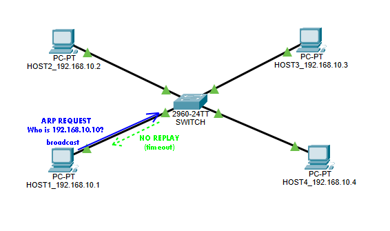

# ARP Resolver

## Uvod
U savremenim mrežama, komunikacija između uređaja zasniva se na složenom skupu protokola koji omogućavaju pouzdanu razmjenu podataka. Jedan od osnovnih protokola u okviru mrežnog sloja je ARP (*engl. Address Resolution Protocol*), čija je osnovna funkcija povezivanje logičkih IP (*engl. Internet Protocol*) adresa sa fizičkim MAC (*engl. Media Access Control*) adresama. Bez ovog protokola, uređaji unutar lokalne mreže ne bi mogli efikasno komunicirati, jer bi nedostajala veza između apstraktnog adresiranja i stvarne hardverske identifikacije. ARP se koristi u gotovo svim Ethernet okruženjima i predstavlja temeljnu komponentu mrežne infrastrukture [1].

## ARP protokol i scenariji razmjene poruka
U Ethernet mrežama svaki put kada host ili ruter treba enkapsulirati IP paket u okvir, poznata je IP adresa sljedećeg uređaja, ali ne i njegova MAC adresa. Da bi se uspostavila komunikacija, koristi se ARP, koji omogućava dinamičko povezivanje IP adrese sa odgovarajućom MAC adresom [1].

Prema Odomu [2], ARP protokol se temelji na razmjeni dvije osnovne poruke:
  - **ARP Request** – poruka kojom jedan host na istoj podatkovnoj vezi traži informaciju o hardverskoj adresi drugog hosta. U poruci se obično navodi poznata ciljna IP adresa, dok je polje za ciljnu hardversku adresu postavljeno na nule. Time se od hosta s navedenom IP adresom traži da u svom ARP Reply odgovoru otkrije vlastitu hardversku (Ethernet) adresu.  
  - **ARP Reply** – poruka kojom uređaj odgovara na prethodno primljeni ARP zahtjev. U njoj se nalaze podaci o hardverskoj (Ethernet) adresi i IP adresi samog pošiljatelja, zapisani u poljima za izvorni hardver i izvornu IP adresu.   

U nastavku su prikazani osnovni scenariji rada ARP Resolvera. Njihova svrha je da se kroz grafičke prikaze i objašnjenja prikažu način na koji se modul ponaša u različitim situacijama, od uobičajenih do onih složenijih. Time se dobija jasna slika o pouzdanosti i pravilnom funkcionisanju sistema u mrežnoj komunikaciji.

### Scenario 1 - Uspješna rezolucija
Na slici 1 prikazan je osnovni tok ARP komunikacije, onaj koji se dešava kada rezolucija IP adrese završi uspješno. HOST1 pokreće proces tako što šalje ARP Request u obliku broadcast poruke: “Ko ima IP adresu 192.168.10.4?”. Ova poruka se prenosi kroz LAN i svi hostovi je primaju, ali samo HOST4 prepoznaje da se traži njegova adresa. On zatim odgovara direktno HOST1 u putem ARP Reply poruke, koja je unicast i sadrži njegovu MAC adresu. HOST1 na osnovu tog odgovora upisuje MAC adresu u svoj registar i signalizira da je rezolucija završena. 

  
  
<b>Slika 1:</b> Grafički prikaz uspješne rezolucije

Na samom početku, sistem se nalazi u reset stanju: signal `reset` je postavljen na logičku jedinicu (`'1'`). Dokle god je `reset` aktivan, svi ostali izlazni signali (`busy`, `done`, `mac_address`) su neaktivni, a modul miruje. Kada `reset` padne na nulu (`'0'`), modul je spreman da pređe u normalan radni tok. U tom trenutku, korisnik inicira rezoluciju aktiviranjem signala `resolve`. Istovremeno se na ulaz `ip_address` postavlja vrijednost IP adrese koju treba razriješiti. Modul reaguje tako što postavlja signal `busy` na jedinicu, čime označava da je proces u toku. Tokom ovog perioda, na izlaznom Avalon-ST interfejsu (`out_data`, `out_valid`, `out_sop`, `out_eop`) generiše se ARP Request poruka.

Nakon slanja zahtjeva, modul prelazi u fazu čekanja. Signal `busy` ostaje aktivan, a ulazni interfejs (`in_data`, `in_valid`, `in_sop`, `in_eop`) se prati kako bi se detektovala dolazna ARP Reply poruka. Kada validan odgovor stigne, modul ga prepoznaje i kao rezultat ne upisuje stvarnu MAC adresu, već aktivira izlazne signale `mac_address` i `done` u trajanju jednog takta. Time se označava da je rezolucija završena i da je odgovor uspješno primljen. Nakon toga, `done` se vraća na nulu, `busy` se deaktivira, i modul se vraća u stanje spremnosti (`IDLE`), čekajući novi zahtjev.

Ovaj scenario je bitan jer pokazuje osnovnu funkcionalnost ARP protokola: kako se IP adrese mapiraju na fizičke MAC adrese i kako se omogućava komunikacija unutar lokalne mreže. Bez ovakve uspješne razmjene, hostovi ne bi mogli slati pakete jedni drugima.

### Scenario 2 - Neuspješna rezolucija 

Slika 2 prikazuje scenario u kojem se opisuje šta se dešava kada se traži IP adresa koja ne postoji u mreži. HOST1 šalje ARP Request kao broadcast, pitajući “Ko ima IP adresu 192.168.10.10?”. Poruka se prenosi kroz LAN i svi hostovi je primaju, ali nijedan od njih nema tu adresu. Zbog toga nema odgovora, nema ARP Reply poruke. HOST1 ostaje u stanju čekanja određeno vrijeme, dok signal `busy` pokazuje da je rezolucija u toku. Kada istekne vrijeme čekanja, modul generiše signal `done`, ali MAC adresa ostaje nevalidna. 

  
  
<b>Slika 2:</b> Grafički prikaz neuspješne rezolucije

Ovaj scenario je važan jer pokazuje kako sistem reaguje na nepostojeće adrese: umjesto da se beskonačno čeka, uvodi se mehanizam timeout-a koji osigurava da se proces završi i da se zna da rezolucija nije uspjela. To je ključno za stabilnost mreže i za sprječavanje blokiranja komunikacije.

### Scenario 3 - Višestruki zahtjevi
Na slici 3 prikazan je treći scenario koji testira ponašanje modula kada se pojavi novi zahtjev dok je prethodni još u toku. HOST1 šalje prvi ARP Request za IP adresu 192.168.10.4, a HOST4 odgovara sa ARP Reply i daje svoju MAC adresu. Dok je modul zauzet obradom tog zahtjeva (`busy`=1), pojavi se novi `resolve` signal, koji je označen kao ARP Request 2. Taj drugi zahtjev se ne šalje u mrežu jer modul ne može paralelno obrađivati više rezolucija. On se ili ignoriše ili stavlja u red čekanja, ali u svakom slučaju ne ide prema switchu dok prvi proces nije završen. Tek kada se prvi zahtjev završi (`done`=1), modul može prihvatiti novi zahtjev. 

  
  
<b>Slika 3:</b> Grafički prikaz višestrukih zahtjeva

Ovaj scenario pokazuje kako se sistem ponaša u slučaju paralelnih zahtjeva i osigurava da se rezolucije obrađuju sekvencijalno, bez konflikata i bez gubitka podataka. Koristeći ovajscenario testirana je robusnost FSM a i potvrđuje da modul pravilno upravlja stanjem zauzetosti.

## Opis ulaznih i izlaznih signala modula

U nastavku su prikazani signali entiteta `arp_resolver` zajedno sa njihovim tipovima i opisima. 

| Tip signala | Naziv signala | Opis |
|-------------|---------------|------|
| Ulaz | `clock : STD_LOGIC` | Standardni sinhroni clock. |
| Ulaz | `reset : STD_LOGIC` | Reset signal. Kada je aktivan, briše interno stanje, vraća FSM u početno stanje i gasi `busy` i `done`. |
| Ulaz | `resolve : STD_LOGIC` | Signal za pokretanje rezolucije. Kada je aktivan u stanju mirovanja, resolver započinje ARP rezoluciju za zadatu IP adresu. |
| Ulaz | `ip_address : STD_LOGIC_VECTOR(31 DOWNTO 0)` | IPv4 adresa koja se traži u mreži. Koristi se za formiranje ARP Request paketa. |
| Izlaz | `done : STD_LOGIC` | Signal završetka. Postaje aktivan kada se rezolucija završi – bilo uspješno ili neuspješno (timeout). |
| Izlaz | `mac_address : STD_LOGIC` | Rezultujuća MAC adresa. Postaje validna kada se primi ispravan ARP Reply. |
| Izlaz | `busy : STD_LOGIC` | Pokazatelj aktivnosti. Aktiviran dok je rezolucija u toku. Sprečava pokretanje novih zahtjeva dok prethodni nije završen. |
| Ulaz | `in_data : STD_LOGIC_VECTOR(7 DOWNTO 0)` | Dolazni bajtovi iz RX interfejsa. Prenose Ethernet okvire (uključujući ARP Reply). |
| Ulaz | `in_valid : STD_LOGIC` | Označava da je trenutni bajt na `in_data` validan. Koristi se zajedno sa `in_ready` za handshake. |
| Ulaz | `in_sop : STD_LOGIC` | Start‑of‑packet signal. Označava početak dolaznog Ethernet okvira. |
| Ulaz | `in_eop : STD_LOGIC` | End‑of‑packet signal. Označava kraj dolaznog Ethernet okvira. |
| Izlaz | `in_ready : STD_LOGIC` | Pokazatelj spremnosti resolvera da primi nove bajtove. Ako je nizak, izvor mora čekati. |
| Izlaz | `out_data : STD_LOGIC_VECTOR(7 DOWNTO 0)` | Odlazni bajtovi prema TX interfejsu. Prenose formirani ARP Request okvir. |
| Izlaz | `out_valid : STD_LOGIC` | Označava da je trenutni bajt na `out_data` validan i može biti prihvaćen ako je `out_ready=1`. |
| Izlaz | `out_sop : STD_LOGIC` | Start‑of‑packet signal za odlazni ARP Request. Označava početak paketa. |
| Izlaz | `out_eop : STD_LOGIC` | End‑of‑packet signal za odlazni ARP Request. Označava kraj paketa. |
| Ulaz | `out_ready : STD_LOGIC` | Pokazatelj spremnosti prijemnika da prihvati bajtove. Resolver šalje podatke samo kada su `out_valid=1` i `out_ready=1`. |

## Dizajn konačnog automata - FSM dijagram

U ovom dijelu predstavljena su stanja FSM-a (*engl. Finite State Machine*) modela za VHDL modul koji implementira ARP rezoluciju MAC adrese. Stanja su definisana na osnovu tri ključna scenarija: uspješna rezolucija, neuspješna rezolucija, te višestruki zahtjevi koji se pojavljuju dok je modul zauzet. 

- **IDLE** - Početno stanje u kojem modul miruje i čeka aktivaciju putem signala `resolve`. U ovom trenutku svi izlazni signali poput `busy` i `done` su neaktivni. Modul ostaje u ovom stanju dok se ne inicira zahtjev za rezoluciju IP adrese.
- **SEND_REQUEST** - Nakon aktivacije, modul prelazi u stanje slanja ARP Request poruke. Kroz Avalon-ST sučelje generiše se niz bajtova koji čine ARP zahtjev, uključujući poznatu IP adresu i nultu MAC adresu. Tokom ovog stanja signal `busy` je aktivan, što označava da je modul zauzet obradom zahtjeva.
- **WAIT_REPLY** - Nakon što je ARP zahtjev poslan, modul prelazi u stanje čekanja na odgovor. Putem ulaznog Avalon-ST sučelja prati se dolazni tok podataka, tražeći validnu ARP Reply poruku. Modul ostaje u ovom stanju dok ne primi odgovor ili dok ne istekne definisani vremenski okvir.
- **RESOLUTION_SUCCESS** - Ukoliko je primljena validna ARP Reply poruka koja odgovara traženoj IP adresi, modul prelazi u stanje uspješne rezolucije. MAC adresa se upisuje u izlazni signal `mac_address`, a signal `done` se aktivira na jedan takt kako bi označio završetak procesa. Nakon toga, modul se vraća u stanje IDLE.
- **RESOLUTION_FAIL** - Ako odgovor nije primljen u predviđenom vremenu ili je nevalidan, modul prelazi u stanje neuspješne rezolucije. Signal `done` se i dalje aktivira, ali `mac_address` ostaje nedefinisan ili postavljen na nultu vrijednost. Modul se zatim vraća u stanje IDLE, spreman za novi zahtjev.
- **MULTIPLE_REQUESTS** - Ukoliko se signal `resolve` pojavi dok je modul već zauzet (`busy = '1'`), prelazi se u stanje višestrukih zahtjeva. U ovom stanju modul može ignorisati dodatne zahtjeve, staviti ih u red čekanja ili ih obraditi sekvencijalno, u zavisnosti od implementacije. Nakon obrade, vraća se u stanje IDLE.

## Modeliranje sklopa u VHDL-u i sinteza u Intel Quartus Prime

## Testno okruženje i verifikacija u ModelSim-u

## Zaključak 

### Smjernice za budući rad

## Literatura
[1] W. Odom, CCNA 200-301 Official Cert Guide, Volume 1, Cisco Press, sve. 1, izd. 1, str. 77-78, 2020.

[2] W. Odom, CCNA 200-301 Official Cert Guide, Volume 2, Cisco Press, sve. 2, izd. 1, str. 496, 2020.

[3] Avalon Interface Specification, Intel Quartus Prime Design Suite 20.1, v2022.01.24

