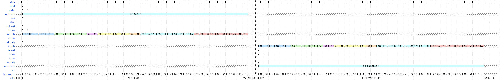
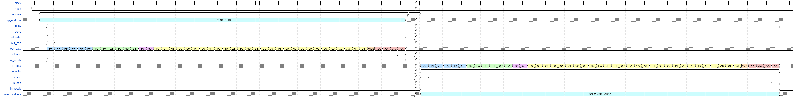

# ARP Resolver

## Uvod
U savremenim mrežama, komunikacija između uređaja zasniva se na složenom skupu protokola koji omogućavaju pouzdanu razmjenu podataka. Jedan od osnovnih protokola u okviru mrežnog sloja je ARP (*engl. Address Resolution Protocol*), čija je osnovna funkcija povezivanje logičkih IP (*engl. Internet Protocol*) adresa sa fizičkim MAC (*engl. Media Access Control*) adresama. Bez ovog protokola, uređaji unutar lokalne mreže ne bi mogli efikasno komunicirati, jer bi nedostajala veza između apstraktnog adresiranja i stvarne hardverske identifikacije. ARP se koristi u gotovo svim Ethernet okruženjima i predstavlja temeljnu komponentu mrežne infrastrukture [1].

## ARP protokol i scenariji razmjene poruka

U Ethernet mrežama svaki put kada korisnik ili router treba enkapsulirati IP paket u okvir, poznata je IP adresa sljedećeg uređaja, ali ne i njegova MAC adresa. Da bi se uspostavila komunikacija, koristi se ARP, koji omogućava dinamičko povezivanje IP adrese sa odgovarajućom MAC adresom [1].

Na taj način ARP postaje sastavni dio procesa enkapsulacije, jer se njegova poruka prenosi upravo unutar Ethernet okvira. Ethernet okvir predstavlja standardizirani oblik prijenosa podataka na sloju podatkovne veze (*engl. Data Link Layer*), gdje se informacije organizuju u jasno definisana polja kako bi komunikacija između uređaja bila pouzdana i dosljedna. Njegova struktura obuhvata zaglavlje sa adresom izvora i odredišta, te završnu kontrolnu vrijednost koja osigurava provjeru ispravnosti prenesenih podataka. Na samom početku okvira nalazi se adresa odredišta, koja zauzima šest bajtova i označava fizičku adresu uređaja kojem je okvir namijenjen. Slijedi adresa izvora, također veličine šest bajtova, koja identificira uređaj pošiljaoca. Treće polje zaglavlja je Type, veličine dva bajta, čija vrijednost određuje protokol koji se prenosi unutar okvira. Kada je vrijednost ovog polja jednaka 0x8060, okvir sadrži poruku protokola ARP [2].

Nakon zaglavlja smješten je segment koji nosi stvarni sadržaj ARP komunikacije. Ovaj dio može predstavljati ARP Request ili ARP Reply, ovisno o tome da li uređaj traži razrješenje IP adrese u odgovarajuću MAC adresu ili odgovara na takav zahtjev. ARP poruka zauzima dvadeset i osam bajtova i sadrži ključne informacije poput tipa operacije, IP i MAC adrese pošiljaoca te IP i MAC adrese ciljnog uređaja. Na taj način, ARP omogućava dinamičko povezivanje logičkih i fizičkih adresa unutar lokalne mreže, čime se osigurava pravilno usmjeravanje paketa [2].

Kako bi okvir zadovoljio minimalnu dužinu propisanu Ethernet standardom, u njega se dodaje padding, odnosno niz dodatnih bajtova koji nemaju semantičku vrijednost. Padding služi isključivo tehničkoj svrsi – popunjavanju okvira do minimalne veličine od 64 bajta, čime se osigurava konzistentnost prijenosa na fizičkom sloju. Na samom kraju okvira nalazi se CRC (*engl. Cyclic Redundancy Check*), polje veličine četiri bajta. CRC predstavlja kontrolnu sumu koja se računa nad cijelim okvirom i omogućava prijemnom uređaju da provjeri integritet primljenih podataka. Ukoliko se CRC vrijednost ne podudara s očekivanom, okvir se odbacuje kao neispravan, čime se osigurava pouzdanost komunikacije [2]. Prethodno opisani okvir, predstavljen je na slici 1:

  
  
<b>Slika 1:</b> Struktura Ethernet okvira [2]

Prema Odomu [3], ARP protokol se temelji na razmjeni dvije osnovne poruke:
  - **ARP Request** – poruka kojom jedan uređaj na istoj podatkovnoj vezi traži informaciju o hardverskoj adresi drugog hosta. U poruci se obično navodi poznata ciljna IP adresa, dok je polje za ciljnu hardversku adresu postavljeno na nule. Time se od uređaja s navedenom IP adresom traži da u svom ARP Reply odgovoru otkrije vlastitu hardversku adresu.  
  - **ARP Reply** – poruka kojom uređaj odgovara na prethodno primljeni ARP zahtjev. U njoj se nalaze podaci o hardverskoj  adresi i IP adresi samog pošiljatelja, zapisani u poljima za izvorni hardver i izvornu IP adresu.   

ARP koristi vrlo jednostavnu strukturu poruke koja može da sadrži zahtjev ili odgovor za rezoluciju adrese. Ove poruke se prenose na sloju podatkovne veze kao sirovi sadržaj paketa. Kada se koristi Ethernet, vrijednost 0x0806 u polju EtherType označava da je riječ o ARP okviru. Dužina ARP poruke zavisi od formata adresa koje se koriste na mrežnom i link sloju. U nastavku prikazana je slika 2 na kojoj je predstavljen jedan ARP paket, te su navedene funkcionalnosti svih polja koja sačinjavaju taj paket. Vrijednosti ARP parametara su standardizovane i održava ih IANA (*engl. Internet Assigned Numbers Authority*) [4].

  
  
<b>Slika 2:</b> Struktura ARP poruke [4]

- **Hardware Type (HTYPE)**: Polje određuje tip protokola mrežne veze. U ovom primjeru, vrijednost 1 označava Ethernet. Dužina polja je 16 bita.
- **Protocol Type (PTYPE)**: Ovo polje određuje internetwork protokol za koji je ARP zahtjev namijenjen. Za IPv4, vrijednost je 0x0800. Dozvoljene vrijednosti PTYPE dijele isti prostor numerisanja kao i EtherType. Dužina polja je 16 bita.
- **Hardware Length (HLEN)**: Polje predstavlja dužinu (u oktetima) hardverske adrese. Za Ethernet, dužina adrese je 6. Dužina polja je 8 bita. 
- **Protocol Length (PLEN)**: Dužina (u oktetima) internetwork adrese. Internetwork protokol je određen u PTYPE. U ovom primjeru: IPv4 adresa ima dužinu 4. Dužina polja je 8 bita. 
- **Operation (OPER)**: Određuje operaciju koju pošiljalac izvodi: 1 za zahtjev, 2 za odgovor.  Dužina polja je 16 bita.
- **Sender Hardware Address (SHA)**: MAC adresa pošiljaoca. U ARP zahtjevu ovo polje označava adresu hosta koji šalje zahtjev. U ARP odgovoru ovo polje označava adresu uređaja koji je tražen. Dužina polja je 48 bita. 
- **Sender Protocol Address (SPA)**: IP adresa pošiljaoca. Dužina polja je 32 bita.
- **Target Hardware Address (THA)**: MAC adresa namijenjenog primaoca. U ARP zahtjevu ovo polje se zanemaruje. U ARP odgovoru ovo polje označava adresu uređaja koji je inicirao ARP zahtjev. Dužina polja je 48 bita. 
- **Target Protocol Address (TPA)**: IP adresa namijenjenog primaoca. Dužina polja je 32 bita [4].

### Scenarij 1 – Uspješna rezolucija 

U lokalnim Ethernet mrežama, kada jedan uređaj želi poslati IP paket drugom uređaju, neophodno je da poznaje njegovu MAC adresu. Ukoliko ta informacija nije dostupna u lokalnoj ARP tabeli, pokreće se proces dinamičke rezolucije adrese putem ARP protokola. Prikazani scenario ilustrira upravo taj tok komunikacije između dva uređaja – ARP Resolvera i ARP Respondera – u kojem se uspješno ostvaruje povezivanje IP adrese sa odgovarajućom MAC adresom.

Proces započinje slanjem ARP Request poruke od strane Resolvera. Ova poruka se enkapsulira unutar Ethernet okvira, čije zaglavlje sadrži broadcast adresu (FF:FF:FF:FF:FF:FF) kao odredišnu, čime se osigurava da poruka stigne do svih uređaja u lokalnoj mreži. Izvorna adresa u zaglavlju je MAC adresa Resolvera, dok polje tipa (Type) nosi vrijednost 0x0806, što označava da se prenosi ARP poruka.

U ARP dijelu okvira nalaze se standardizovana polja: HTYPE (Ethernet), PTYPE (IPv4), HLEN i PLEN (dužine MAC i IP adresa), te OPER sa vrijednošću 1, što označava zahtjev. Polja SHA i SPA sadrže MAC i IP adresu pošiljaoca, dok je THA postavljeno na nule, jer MAC adresa ciljnog uređaja još nije poznata. Polje TPA sadrži IP adresu uređaja čija se MAC adresa traži – u ovom slučaju Respondera.

Nakon prijema ARP Requesta, Responder analizira sadržaj poruke. Ključna provjera odnosi se na polje TPA: ukoliko se njegova vrijednost podudara sa lokalnom IP adresom Respondera, uređaj prepoznaje da je upravo on traženi cilj. U tom trenutku generiše ARP Reply poruku, koja se šalje direktno Resolveru putem unicast Ethernet okvira. U zaglavlju okvira sada se kao odredišna adresa navodi MAC adresa Resolvera, dok izvorna ostaje MAC adresa Respondera. Polje tipa ostaje 0x0806, jer se i dalje prenosi ARP sadržaj.

U ARP dijelu odgovora, polje OPER dobija vrijednost 2, što označava odgovor. Polja SHA i SPA sada sadrže MAC i IP adresu Respondera, dok se u THA i TPA upisuju vrijednosti koje su prethodno došle od Resolvera. Na taj način se uspostavlja veza između IP adrese cilja i njegove fizičke adrese, čime se omogućava daljnja komunikacija na mrežnom sloju.

Prikazani sekvencijski dijagram ilustrira tok: ARP Request se šalje kao broadcast, dok se ARP Reply vraća kao unicast. Iako dijagram prikazuje samo dva učesnika – Resolvera i Respondera – implicitno se podrazumijeva da broadcast poruka može biti primljena od strane svih uređaja u mreži, ali samo onaj čija IP adresa odgovara vrijednosti u TPA polju odgovara na zahtjev.

Ovaj scenario, koji je prikazan na slici 3, predstavlja idealan tok ARP razmjene, bez grešaka u sadržaju poruke, što rezultira uspješnom rezolucijom adrese i ažuriranjem lokalne ARP tabele kod Resolvera.

  
  
<b>Slika 3:</b> Sekvencijski dijagram za scenario uspješne rezolucije 

### Scenarij 2 – Neuspješna rezolucija

U ovom scenariju prikazana je situacija u kojoj ARP komunikacija ne rezultira uspješnom rezolucijom adrese, iako je formalno posmatrano razmjena poruka izvršena. Proces započinje identično kao u prethodnom slučaju: ARP Resolver šalje ARP Request poruku u kojoj traži MAC adresu uređaja čija je IP adresa poznata. Ethernet okvir se formira sa broadcast odredišnom adresom (FF:FF:FF:FF:FF:FF), dok se u ARP dijelu poruke navode standardizovana polja – tipovi protokola, dužine adresa, operacija (OPER = 1), te adrese pošiljaoca i cilja. Polje THA ostaje prazno, jer MAC adresa cilja još nije poznata.

Međutim, za razliku od prethodnog scenarija, odgovor koji dolazi od Respondera ne zadovoljava očekivanja Resolvera. Iako je okvir tehnički ispravno formiran – sa unicast odredišnom adresom, validnim zaglavljem i CRC kontrolom – sadržaj ARP poruke sadrži nepravilnosti. Ključna razlika u ovom slučaju jeste vrijednost polja OPER, koja iznosi 3, umjesto standardne vrijednosti 2 koja označava ARP Reply. Ova razlika signalizira da se ne radi o validnom ARP odgovoru, te Resolver odbacuje primljeni paket.

Sekvencijski dijagram prikazuje tok: nakon što se ARP Request pošalje, Responder vraća poruku koja formalno izgleda kao odgovor, ali zbog odstupanja u sadržaju – bilo u operaciji, adresama ili drugim poljima – Resolver ne izvršava rezoluciju. Paket se ignoriše, a MAC adresa cilja ostaje nepoznata. Ovakav tok komunikacije naglašava važnost validacije sadržaja ARP poruke, jer se ne prihvataju odgovori koji odstupaju od standarda, bez obzira na to što okvir na fizičkom sloju može biti tehnički ispravan. Opisani dijagram prikazan je na slici 4: 

  
  
<b>Slika 4:</b> Sekvencijski dijagram za scenario neuspješne rezolucije 

## Opis ulaznih i izlaznih signala modula

Signali koji se koriste tokom izrade zadanog modula, predstavljeni su u nastavku: 

| IN/OUT | Tip                | Signal       | Opis                                                                |
|-----------|---------------------|--------------|-----------------------------------------------------------------------------|
| IN        | STD_LOGIC           | clock        | Clock signal koji pokreće sekvencijalnu logiku.                              |
| IN        | STD_LOGIC           | reset        | Asinhroni reset, vraća modul u početno stanje.                              |
| IN        | STD_LOGIC           | resolve      | Impuls kojim se inicira ARP rezolucija za zadati `ip_address`. Aktivan kada Resolver šalje ARP zahtjev i čeka ARP odgovor. |
| IN        | STD_LOGIC_VECTOR(31 downto 0) | ip_address   | IP adresa za koju se traži MAC adresa.                                      |
| OUT       | STD_LOGIC           | done         | Impuls (1 takt) označava da je rezolucija završena i da je `mac_address` validan. |
| OUT       | STD_LOGIC_VECTOR(47 downto 0) | mac_address  | Rezultat rezolucije – MAC adresa dobijena iz ARP reply paketa.              |
| OUT       | STD_LOGIC           | busy         | Pokazuje da je rezolucija u toku; postaje aktivan (1) nakon `out_sop=1`, a vraća se na 0 nakon `done=1` (za uspješnu rezoluciju) ili nakon `done=0 & in_eop=1` (za neuspješnu rezoluciju). |
| IN        | STD_LOGIC_VECTOR(7 downto 0)  | in_data      | Bajt‑stream ARP reply paketa (Ethernet + ARP polja).                        |
| IN        | STD_LOGIC           | in_valid     | Označava da je bajt na `in_data` važeći.                                    |
| IN        | STD_LOGIC           | in_sop       | Start of packet – aktivan na prvom bajtu ARP reply paketa.                  |
| IN        | STD_LOGIC           | in_eop       | End of packet – aktivan na zadnjem bajtu ARP reply paketa.                  |
| OUT       | STD_LOGIC           | in_ready     | Izlaz iz modula koji pokazuje da li je modul spreman da primi sljedeći bajt.     |
| OUT       | STD_LOGIC_VECTOR(7 downto 0)  | out_data     | Bajt‑stream ARP request paketa (sva polja).                      |
| OUT       | STD_LOGIC           | out_valid    | Označava da je bajt na `out_data` važeći.                                   |
| OUT       | STD_LOGIC           | out_sop      | Start of packet – aktivan na prvom bajtu ARP request paketa.                |
| OUT       | STD_LOGIC           | out_eop      | End of packet – aktivan na zadnjem bajtu ARP request paketa.                |
| IN        | STD_LOGIC           | out_ready    | Dolazi od prijemnika; pokazuje da li može da primi sljedeći bajt.            |

Za opis signala korišteni su opisi Avalon-ST interface-a [5].

### Scenario 1 - Uspješna rezolucija

Prikazani dijagram signala ilustrira scenarij uspješne ARP rezolucije, odnosno proces slanja ARP zahtjeva i prijema odgovora u lokalnoj mreži. Cilj ovog scenarija je da se za zadatu IP adresu dobije odgovarajuća fizička adresa, čime se omogućava ispravno adresiranje Ethernet okvira i daljnja IP komunikacija. Dijagram prikazuje vremensku zavisnost ključnih kontrolnih i podatkovnih signala, te jasno demonstrira kako se kompletna ARP razmjena odvija od inicijalizacije do uspješnog završetka.

Proces započinje aktiviranjem signala `resolve`, čime se inicira ARP procedura za IP adresu koja je prisutna na ulazu `ip_address`. U ovom trenutku modul ulazi u fazu obrade zahtjeva, što se vidi kroz aktivaciju signala `busy`, koji ostaje postavljen tokom cijelog trajanja ARP razmjene. Na izlazu `out_valid` pojavljuje se validan podatkovni tok, dok se kroz `out_data` sekvencijalno šalju bajtovi ARP Request poruke. U početnim bajtovima jasno se prepoznaje odredišna MAC adresa postavljena na broadcast vrijednost (FF:FF:FF:FF:FF:FF), čime se osigurava da svi uređaji u lokalnoj mreži prime upit. Nakon toga slijede polja koja definiraju Ethernet tip, ARP zaglavlje, te informacije o pošiljaocu, uključujući njegovu MAC i IP adresu, kao i ciljnu IP adresu za koju se traži fizička adresa.

Tokom slanja ARP zahtjeva, signal `out_ready` potvrđuje da je komunikacijski interfejs spreman za prihvat svakog bajta, dok se `byte_counter` inkrementira i prati redoslijed slanja kompletne ARP poruke. Po završetku slanja posljednjeg bajta zahtjeva, izlazni podaci se zaustavljaju, a modul prelazi u fazu čekanja odgovora, što se na dijagramu vidi kao period bez aktivnog `out_valid` signala, dok `busy` ostaje aktivan.

Nakon određenog vremenskog intervala, na ulazu `in_data` pojavljuje se dolazni podatkovni tok, praćen aktivacijom signala `in_valid`, što označava prijem ARP Reply poruke. Bajtovi odgovora dolaze redom i sadrže MAC adresu uređaja koji posjeduje traženu IP adresu. U okviru ovog toka, polja ARP zaglavlja potvrđuju da se radi o odgovoru, dok dio poruke koji nosi adresne informacije sada sadrži traženu fizičku adresu. Tokom prijema, `in_ready` signalizira da je modul spreman da prihvati dolazne podatke, dok se `byte_counter` ponovo koristi za praćenje redoslijeda prijema.

Po uspješnom prijemu kompletnog ARP odgovora, izdvojena MAC adresa se pojavljuje na izlazu `mac_address`, čime je proces rezolucije završen. Istovremeno se aktivira signal `done`, koji označava kraj ARP procedure, dok se `busy` deaktivira, potvrđujući da je modul slobodan za novu operaciju. Izostanak aktivacije internog signala `error` tokom cijelog procesa dodatno potvrđuje da je ARP razmjena uspješno realizirana bez grešaka.

Na ovaj način dijagram jasno prikazuje kompletan tok ARP komunikacije, od iniciranja zahtjeva, preko emitovanja ARP Request poruke, do prijema i obrade ARP Reply odgovora, čime se demonstrira ispravna i uspješna rezolucija IP adrese u MAC adresu unutar lokalne mreže. Grafički prikaz opisanog scenarija predstavljen je na slici 5:

  
  
<b>Slika 5:</b> Waveform za uspješnu rezoluciju 

### Scenario 2 - Neuspješna rezolucija 

Drugi prikazani scenarij u osnovi slijedi isti početni tok kao i prethodno opisani slučaj. Postupak se također inicira aktiviranjem signala `resolve` za zadatu IP adresu, nakon čega se šalje ARP Request poruka u lokalnu mrežu, koristeći broadcast odredišnu MAC adresu. Tokom ove faze prisutni su identični mehanizmi kontrole prijenosa podataka, uključujući validaciju izlaznog toka i praćenje redoslijeda bajtova, dok modul ostaje zauzet i čeka odgovor iz mreže. Na ovaj način oba scenarija demonstriraju standardni početak ARP rezolucije i pravilno formiranje ARP upita.

Ključna razlika u odnosu na prvi scenarij nastupa nakon završetka slanja ARP zahtjeva i ulaska u fazu čekanja odgovora. Za razliku od prethodnog slučaja, u ovom scenariju dolazni ARP okvir koji se pojavljuje na ulazu ne predstavlja važeći odgovor na prethodno poslani zahtjev. Iako se na `in_data` i `in_valid` signalima pojavljuje strukturiran podatkovni tok koji na prvi pogled odgovara ARP poruci, njegov sadržaj ne zadovoljava kriterije potrebne za uspješnu rezoluciju tražene IP adrese. Kao posljedica toga, primljeni okvir se prepoznaje kao nerelevantan i biva zanemaren, bez izdvajanja MAC adrese i bez završetka postupka.

Tokom ovog procesa modul zadržava aktivan status zauzetosti, čime se jasno pokazuje da prijem neodgovarajuće ARP poruke ne dovodi do prekida ili pogrešnog završetka procedure. Umjesto toga, sistem ostaje spreman da i dalje čeka ispravan ARP Reply koji odgovara inicijalno poslanom upitu. Upravo ovakav pristup osigurava robusnost ARP implementacije u realnim mrežnim uslovima, gdje se u istom trenutku može pojaviti veći broj ARP poruka koje nisu nužno povezane s konkretnim zahtjevom.

Implementacija ovog scenarija ima za cilj demonstrirati sposobnost sistema da razlikuje relevantne i nerelevantne ARP odgovore, te da pravilno ignoriše poruke koje ne doprinose traženoj rezoluciji. Time se izbjegava mogućnost pogrešnog mapiranja IP i MAC adresa, ali i potencijalni sigurnosni i funkcionalni problemi. U poređenju s prvim scenarijem, koji prikazuje idealan slučaj uspješne razmjene, ovaj scenarij naglašava ponašanje sistema u prisustvu „šuma“ u mreži i potvrđuje ispravnost implementacije u realističnim komunikacijskim okruženjima. Grafički prikaz opisanog scenarija predstavljen je na slici 6:

  
  
<b>Slika 6:</b> Waveform za neuspješnu rezoluciju 

## Dizajn konačnog automata – FSM dijagram

Konačni automat (*engl. Finite State Machine – FSM*) je matematički model koji opisuje ponašanje sistema kroz konačan broj stanja, gdje se sistem u svakom trenutku nalazi u tačno jednom stanju. Prelazi između tih stanja definišu se skupom ulaznih uslova, a svaka promjena stanja predstavlja reakciju sistema na spoljašnje signale. FSM se koristi za modeliranje sekvencijalne logike u digitalnim sklopovima, softverskim kontrolerima i komunikacijskim protokolima, jer omogućava precizno upravljanje tokom izvršavanja i determinističko ponašanje sistema [6].

Modul ARP_Resolver strukturiran je kao deterministički FSM koji upravlja procesom razmjene ARP okvira u mrežnom podsistemu. FSM je organizovan kroz jasno definisana stanja i prijelaze, čime se modelira cjelokupan tok obrade: od inicijalnog mirovanja, preko slanja zahtjeva, čekanja odgovora i prijema okvira, pa sve do završetka ili odbacivanja nevalidnih podataka. Na priloženom dijagramu na slici 7 prikazana su sva relevantna stanja (IDLE, SENDING REQUEST, WAITING FOR REPLY, RECEIVING REPLY, DISCARDING FRAME, DONE) i prijelazi koji određuju dinamiku rada modula. Ovakva organizacija omogućava da se svaki ARP zahtjev i odgovor obradi u kontrolisanom slijedu, uz jasnu separaciju faza i predvidiv povratak sistema u početno stanje nakon završetka procesa.

  
  
<b>Slika 7:</b> FSM dijagram stanja ARP Resolvera

**IDLE** – Ovo stanje predstavlja početno stanje automata. U ovom stanju sistem ne vrši nikakvu aktivnu obradu podataka i spreman je da započne novu ARP rezoluciju. Automat ostaje u ovom stanju sve dok ne dođe do aktivacije signala `resolve`, čime se inicira postupak ARP rezolucije. Aktiviranjem ovog signala automat napušta stanje IDLE i prelazi u stanje ARP_REQUEST, u kojem započinje formiranje i slanje ARP upita.

**ARP_REQUEST** – U stanju ARP_REQUEST automat formira i šalje ARP Request poruku. Tokom boravka u ovom stanju, bajtovi Ethernet zaglavlja i ARP paketa se sekvencijalno pakuju i prosljeđuju prema ARP Responderu. Ukupan broj poslanih bajtova iznosi 42, što uključuje kompletno Ethernet zaglavlje i ARP poruku. Automat ostaje u ovom stanju sve dok se ne pošalje posljednji bajt ARP zahtjeva, nakon čega prelazi u stanje čekanja odgovora.

**WAITING_FOR_REPLY** – Stanje WAITING_FOR_REPLY označava fazu u kojoj automat pasivno čeka dolazni ARP odgovor iz mreže. Tokom ovog perioda ne vrši se aktivna obrada podataka, već se nadgleda dolazni interface. Automat ostaje u ovom stanju sve dok ne budu istovremeno aktivni signali `in_sop = 1` i `in_valid = 1`, čime se detektuje početak dolaznog ARP okvira i započinje proces prijema odgovora.

**RECEIVING_REPLY** – U stanju RECEIVING_REPLY automat aktivno prima i analizira dolaznu ARP Reply poruku. Tokom prijema bajtova provjerava se ispravnost sadržaja paketa i relevantnost odgovora u odnosu na prethodno poslani zahtjev. Automat ostaje u ovom stanju sve dok se ne ispuni jedan od dva uslova: ukoliko interni signal `error` postane aktivan, što ukazuje na neispravan ili nerelevantan paket, automat prelazi u stanje IGNORE; u slučaju da se detektuje uspješan završetak prijema, označen pojavom `in_sop = 1`, automat prelazi u stanje DONE, čime se potvrđuje uspješna ARP rezolucija.

**DONE** – Stanje DONE signalizira da je postupak ARP rezolucije uspješno završen i da je tražena MAC adresa pronađena. U ovom stanju rezultat rezolucije postaje dostupan na izlazu, dok se aktivira signal koji označava završetak procesa. Automat ostaje u ovom stanju sve dok signal `done` ne postane neaktivan, nakon čega se vraća u stanje IDLE, spreman za novu operaciju.

**IGNORE** – Stanje IGNORE služi za obradu situacija u kojima primljeni paketi ne predstavljaju važeći ARP odgovor na poslani zahtjev. U ovom stanju automat ignoriše dolazne bajtove sve dok traje prijem trenutnog okvira, bez pokušaja obrade ili izdvajanja adresnih informacija. Nakon završetka prijema neispravnog paketa, sistem se vraća u stanje IDLE, čime se omogućava pokretanje nove ARP rezolucije.

## Modeliranje sklopa u VHDL-u i sinteza u Intel Quartus Prime

## Testno okruženje i verifikacija u ModelSim-u

## Zaključak 

### Smjernice za budući rad

## Literatura
[1] W. Odom, CCNA 200-301 Official Cert Guide, Volume 1, Cisco Press, sve. 1, izd. 1, str. 77-78, 2020.

[2] "What is ARP? Address Resolution Protocol" (bez dat.). Dostupno na: https://nexgent.com/what-is-arp-address-resolution-protocol/ [pristupano 22.12.2025.]

[3] W. Odom, CCNA 200-301 Official Cert Guide, Volume 2, Cisco Press, sve. 2, izd. 1, str. 496, 2020.

[4] "Address Resolution Protocol" (bez dat.). u Wikipedia, the Free Encyclopedia. Dostupno: https://en.wikipedia.org/wiki/Address_Resolution_Protocol [pristupano 09.12.2025.]

[5] Avalon Interface Specification, Intel Quartus Prime Design Suite 20.1, v2022.01.24

[6] "Finite-state machine" (bez dat.). u Wikipedia, the Free Encyclopedia. Dostupno: https://en.wikipedia.org/wiki/Finite-state_machine [pristupano 03.01.2026.]

